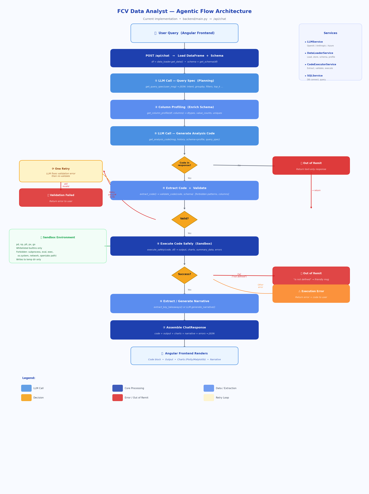

# FCV Data Analyst — FastAPI Backend

FastAPI backend for the FCV Data Analyst chatbot. Implements an **agentic flow** that plans queries, generates Python analysis code via LLM, validates and sandboxes execution, and returns results with charts and narrative.



## Features

- **Agentic Chat Pipeline** — structured query planning → column profiling → code generation → validation (with retry) → sandboxed execution → narrative
- **ACLED Data Auto-Load** — default conflict dataset loaded on startup from local CSV
- **LLM Integration** — OpenAI, Anthropic (Claude, default), and Azure OpenAI (ITSAI Platform)
- **Safe Code Execution** — sandboxed environment with whitelisted builtins; forbidden patterns (subprocess, eval, exec, network, absolute paths) are blocked
- **Visualization** — automatic chart generation with Matplotlib and Plotly
- **Narrative Generation** — AI-powered key-takeaways summaries
- **SQL Database Support** — connect to SQL Server, PostgreSQL, or MySQL; execute queries and load results

## Setup

### 1. Install Dependencies

```bash
cd backend
pip install -r requirements.txt
```

### 2. Environment Variables

Create a `.env` file in the `backend/` directory (see `env.example`):

```env
# LLM Provider: openai | anthropic | azure (default: anthropic)
LLM_PROVIDER=anthropic

# LLM Model (default: claude-sonnet-4-5 for Anthropic)
LLM_MODEL=claude-sonnet-4-5

# API Keys (set at least one)
ANTHROPIC_API_KEY=your-anthropic-key
OPENAI_API_KEY=your-openai-key

# Azure OpenAI (optional)
AZURE_OPENAI_ENDPOINT=https://your-endpoint.openai.azure.com/

# Default ACLED data path (auto-loaded on startup)
ACLED_DEFAULT_PATH=C:\path\to\acled_data_current.csv
```

### 3. Run the Server

```bash
# Development
python main.py

# Or with uvicorn directly
uvicorn main:app --reload --host 0.0.0.0 --port 8000
```

The API will be available at `http://localhost:8000`

## API Documentation

Once running, visit:
- **Swagger UI**: http://localhost:8000/docs
- **ReDoc**: http://localhost:8000/redoc

## API Endpoints

### Health Check
| Method | Path | Description |
|--------|------|-------------|
| `GET` | `/` | Basic health check |
| `GET` | `/api/health` | Detailed health check |

### Data Management
| Method | Path | Description |
|--------|------|-------------|
| `POST` | `/api/data/upload` | Upload CSV file |
| `POST` | `/api/data/load-url` | Load data from URL(s) |
| `POST` | `/api/data/load-path` | Load from local path (omit body for default ACLED) |
| `GET` | `/api/data/schema` | Get current data schema |

### Configuration
| Method | Path | Description |
|--------|------|-------------|
| `POST` | `/api/config` | Update LLM API configuration |
| `GET` | `/api/config/env` | Show env variable names for API keys |

### Chat
| Method | Path | Description |
|--------|------|-------------|
| `POST` | `/api/chat` | Send message → agentic analysis pipeline |

### SQL Database
| Method | Path | Description |
|--------|------|-------------|
| `POST` | `/api/sql/connect` | Connect to SQL database |
| `POST` | `/api/sql/query` | Execute SQL query and load results |
| `GET` | `/api/sql/tables` | List all tables in connected database |
| `POST` | `/api/sql/disconnect` | Disconnect from database |

### Sessions
| Method | Path | Description |
|--------|------|-------------|
| `GET` | `/api/sessions` | List all active sessions |
| `DELETE` | `/api/session/{session_id}` | Delete a session and its data |

## Agentic Flow (`POST /api/chat`)

The chat endpoint implements a multi-step agentic pipeline:

1. **Load Data + Schema** — fetch the in-memory DataFrame and generate schema
2. **Query Spec (Planning)** — LLM call to produce a structured JSON plan (intent, groupby, filters, top_k, output format)
3. **Column Profiling** — enrich schema with dtypes, value_counts, and uniques for relevant columns
4. **Code Generation** — LLM call to produce full Python analysis code using schema + profile + query spec
5. **Code Check** — if no code block in response → treat as out-of-remit and return text only
6. **Extract + Validate** — extract Python from markdown; validate against forbidden patterns and allowed columns
7. **Retry (once)** — if validation fails, ask LLM to fix and re-validate; if still invalid, return error
8. **Sandboxed Execution** — run code with whitelisted globals (pd, np, plt, px, go, builtins); writes go to temp dir
9. **Error Handling** — "not defined" errors → friendly out-of-remit message; other errors → return to user
10. **Narrative** — extract key takeaways from LLM response, or generate via separate LLM call
11. **Response Assembly** — return code + output + charts + narrative + errors as JSON

## Architecture

```
backend/
├── main.py                  # FastAPI app, endpoints, agentic chat pipeline
├── models.py                # Pydantic request/response models
├── requirements.txt         # Python dependencies
├── env.example              # Example environment variables
├── agentic_flow_architecture.png  # Visual architecture diagram
├── services/
│   ├── __init__.py
│   ├── data_loader.py       # Data loading, storage, schema, column profiling
│   ├── llm_service.py       # LLM API integration (OpenAI, Anthropic, Azure)
│   ├── code_executor.py     # Code extraction, validation, sandboxed execution
│   └── sql_service.py       # SQL database connections and queries
└── README.md
```

## Security Notes

- Code execution is sandboxed: only whitelisted builtins and libraries (pandas, numpy, matplotlib, plotly) are available
- Forbidden patterns block subprocess, eval, exec, os.system, network requests, and absolute-path file access
- Column validation ensures generated code only references columns that exist in the data
- Always use HTTPS in production
- Store API keys via environment variables or secrets management
- Implement rate limiting for production deployment
